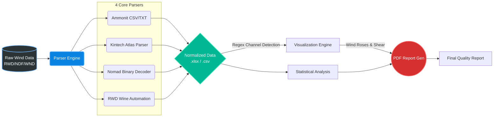

<div align="center">
  
  
  

  <br><br>

  <h1>🌪️ NIWE Parsers</h1>
  <p><b>Advanced Data Parsing, Visualization, and Reporting for Wind Meteorological Loggers</b></p>

  <br>
</div>

---

## 📖 Overview

**NIWE Parsers** is a state-of-the-art automated software pipeline designed to decode, analyze, and visualize raw meteorological data from industry-standard **Wind Data Loggers**. 

The system handles full end-to-end processing: from reverse-engineering binary payloads and parsing raw formats, to generating interactive wind visualizations (wind roses, wind shear profiles, cross-correlations) and publishing comprehensive quality reports in PDF format.

> **Note:** Developed for advanced wind data analysis, anomaly detection, and meteorological reporting.

<br>

## ✨ Key Features

* 🔌 **Universal Wind Data Decoding**: Automatically sniff and decode complex, proprietary binary formats and raw text files from anemometers, vanes, and environmental sensors.
* 📊 **Intelligent Wind Visualizations**: Generate high-quality statistical plots including Wind Roses, Correlation Heatmaps, and Wind Shear profiles.
* 📑 **Automated PDF Reporting**: Compile data quality summaries, sensor statistics, and visualizations into professional, client-ready PDF reports.
* ⚙️ **Batch Processing**: Scalable CLI tools to decode and process entire directories of logger outputs in one seamless operation.

<br>

## 🏗️ Architecture: The 4 Core Parsers

The project is modularized into four dedicated parsers and processors, tailored to specific hardware manufacturers. Below is a deep-dive into how every module operates internally.

<details>
<summary><b>1. Ammonit (<code>ammonit/</code>)</b></summary>
<br>

**Purpose:** Parsing pipelines for Ammonit meteorological masts.
* **How it works:** 
  * The `batch_decode.py` script automatically discovers raw files and pushes them through a standard parsing pipeline (`parse_logger_file`).
  * It detects channels using exact string matching (e.g., looking for *"speed"*, *"dir"*, *"temperature"*, *"battery"* combined with metric units).
  * **Wind Shear ($\alpha$) Extraction:** It looks for specific height markers in the headers (e.g., `100`, `80`, `50`, `10`), aggregates the mean wind speeds at these heights, and automatically computes the wind shear exponent using the top two highest available anemometers.
  * It generates text-based statistical quality reports (`summary.txt`, `quality_report.txt`, `statistics_report.txt`) before rendering the final PDF.
</details>

<details>
<summary><b>2. Kintech (<code>kintech/</code>)</b></summary>
<br>

**Purpose:** Dedicated parsers for Kintech engineering systems (Atlas Output Data Files).
* **How it works:** 
  * The `kintech_parser.py` acts as the entry point, reading raw `.wnd` files.
  * It provides powerful temporal transformations via `RecordTransformer` (located in `core/transform.py`). 
  * **Windographer Emulation:** By passing `--format windographer`, the parser will automatically resample the native interval (e.g., 5-minute data) to a 10-minute grid, compute derived statistics (Gust, Turbulence Intensity, Air Density), and shift timestamps to match Windographer conventions (interval-start indexing).
  * It handles gap-filling (inserting blank rows for missing timestamps) seamlessly.
</details>

<details>
<summary><b>3. Nomad (<code>nomad/</code>)</b></summary>
<br>

**Purpose:** Universal decoder focusing on complex binary structure decoding for Nomad 2 / Nomad 3 loggers.
* **How it works:** 
  * This is a complete reverse-engineering of the proprietary `.ndf` binary format.
  * `decoders/nomad_ndf.py` reads the binary byte-by-byte:
    * **Preamble (0x0000):** Extracts logger serial, site name, and elevation.
    * **Channel Table (0x0040):** Extracts calibration slopes, offsets, sensor heights, and models (e.g., "SWI C3").
    * **Dense Data (0x0908):** Reads 16-byte raw float values mapped to exact sensor slots.
  * **Fingerprinting:** Because sensor slots change based on firmware deployment, the decoder builds a *fingerprint* of the channel layout (e.g., `SOMAGUDDA_460_LAYOUT` vs `ROJMAL_2_LAYOUT`) to ensure the 53 available binary slots map perfectly to the correct metric (Avg, SD, Gust, TimeOfMax).
</details>

<details>
<summary><b>4. RWD Automation (<code>RWD_Automation/</code>)</b></summary>
<br>

**Purpose:** Automation pipeline for continuous Raw Wind Data (RWD) processing, specifically for NRG Systems loggers.
* **How it works:** 
  * The `batch_decode.py` script orchestrates a complex cross-platform conversion. It uses `wine` (on macOS) to silently run the proprietary Windows-only `SDR.exe` utility, converting `.RWD` binaries into raw tab-delimited text files.
  * **Dynamic Header Resolution:** It parses the metadata header of the generated SDR txt files to extract the Channel number, Description, Serial Number, and Height. 
  * It maps generic columns like `CH1Avg` to highly descriptive names like `WindSpeed_100m_SN1933_Avg`. It also handles duplicate resolving automatically.
  * Finally, it feeds this cleaned DataFrame into the centralized Visualization and PDF reporting engines.
</details>

<br>

## ⚙️ Visualizations & The Wind Data Engine

Once data is extracted and normalized by any of the 4 parsers above, it is passed into `visualize_outputs.py`. The core engine relies on intelligent column detection and specialized wind data mathematics:

### 1. Intelligent Channel Detection
The system parses the raw data headers using smart Regular Expressions (Regex) to dynamically identify wind channels regardless of the logger's naming convention.
```python
REGEX_WS = re.compile(r"Spd|Wind Speed|WS|Anemometer|WindSpeed", re.IGNORECASE)
REGEX_WD = re.compile(r"Dir|Direction|WD|WindDirection|Vane", re.IGNORECASE)
```

### 2. Wind Shear Calculation ($\\alpha$)
The engine automatically extracts height metadata from column names (e.g., `WindSpeed_100m_SN1933_Avg` -> `100m`) and computes the **Wind Shear Exponent ($\\alpha$)** using the Power Law profile. It utilizes the highest ($H_2$) and lowest ($H_1$) anemometer readings ($V_2, V_1$):
$$ \\alpha = \\frac{\\ln(V_2 / V_1)}{\\ln(H_2 / H_1)} $$
*This mathematically determines the vertical wind speed gradient.*

### 3. Wind Rose Generation
By coupling the detected Wind Speed (`ws_col`) and Wind Direction (`wd_col`) channels, the engine groups the data into directional sectors and speed bins. The valid intersections are mapped onto a polar coordinate system using `WindroseAxes` to generate a beautiful directional frequency distribution.

### 4. Anomaly Detection via Correlation
The `plot_correlation_heatmap` function computes the Pearson correlation matrix across all numeric wind data columns. This highlights inconsistencies, such as iced anemometers (where correlation drops between redundant sensors at the same height).

<br>

## 🛤️ Pipeline Workflow



<br>

## 🚀 Quick Start

### 1. Installation

Ensure you have Python 3.9+ installed. The environment requires standard data processing and plotting libraries (`pandas`, `matplotlib`, `seaborn`, `windrose`, `fpdf2`, `openpyxl`). 

> **Note:** `RWD_Automation` requires `wine` installed on macOS.

### 2. Processing Data

Each parser module comes with a unified `main.py` CLI entry point (or `batch_decode.py`) for orchestration.

**Example: Processing Kintech Wind Data**
```bash
cd kintech

# Run the full pipeline (Decode -> Visualize -> Report)
python3 main.py

# Only generate visualizations (skip decoding)
python3 main.py --visualize-only
```

**Example: Decoding Nomad Binary Wind Data**
```bash
cd nomad

# Auto-detect binary format and export to Excel workbook
python3 main.py input/01-00001.NDF
```

<br>

## 📂 Project Structure

```text
NIWE Parsers/
├── ammonit/                  # Ammonit mast parsers & reporting
│   └── batch_decode.py       # Regex channel detection & shear math
├── kintech/                  # Kintech logger decoding pipeline
│   ├── core/transform.py     # Time-series resampling & shifting
│   └── main.py               # Kintech CLI orchestration
├── nomad/                    # Nomad universal binary decoders
│   └── decoders/nomad_ndf.py # Binary byte-extraction & fingerprinting
└── RWD_Automation/           # Raw Wind Data automation scripts
    └── batch_decode.py       # Wine execution & HDR parsing
```

<br>

---
<div align="center">
  <p><i>Developed for the National Institute of Wind Energy (NIWE)</i></p>
</div>
