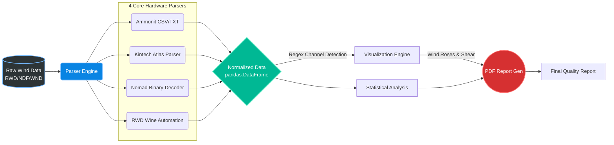

<div align="center">
  
  
  
  

  <br><br>
  <h1>NIWE Parsers</h1>
  <p><b>An advanced, production-grade meteorological data pipeline for parsing, reverse-engineering, visualizing, and reporting on industry-standard Wind Data Loggers.</b></p>
  <br>
</div>

---

## Overview

**NIWE Parsers** is a highly specialized data engineering framework built to extract maximum value from raw meteorological loggers used in the wind energy sector. 

Whether you are dealing with proprietary, undocumented binary files (`.ndf`), raw text dumps (`.txt`), or encrypted engineering outputs (`.wnd`), this pipeline provides a robust, end-to-end mechanism to reverse-engineer, parse, standardize, and visualize the data into client-ready PDF reports.

> **Note:** This project was developed strictly for advanced wind resource assessment, anomalous sensor detection, and air-density-adjusted power density calculations.

## Key Features & Capabilities

* **Universal Binary Reverse-Engineering:** Equipped with a format-agnostic `binary_scanner.py` that computes column-wise variability and byte-frequency to crack unknown logger firmware formats.
* **Windographer Emulation:** Faithfully resamples native intervals, shifts timestamps (interval-start indexing), and handles gap-filling (inserting blank rows) to perfectly mimic standard Windographer exports.
* **Advanced Meteorological Math:** Automatically computes Ideal Gas Air Density ($\\rho$), Wind Power Density (WPD), Turbulence Intensity (TI30), and Wind Shear ($\\alpha$).
* **Automated Visual Analytics:** Dynamically generates publication-ready Wind Roses, vertical Wind Shear profiles, and Pearson correlation matrices to detect iced or failing anemometers.

---

## Architecture: The 4 Core Parsers

The system is decoupled into four highly specialized hardware parsers. Below is a deep-dive into the precise internal mechanics of each module:

### 1. Ammonit (`ammonit/`)
Designed for **Ammonit** meteorological masts, focusing on extracting heavily nested CSV/TXT files.

**Working:**
* **Intelligent Sniffing:** Automatically identifies channels by scanning for regex patterns (e.g., matching `Speed` + `m/s` or `Direction` + `deg`).
* **Vertical Shear Extraction:** It parses sensor heights directly from the column headers (e.g., `WindSpeed_100m`) and dynamically aggregates the mean wind speeds to calculate the Wind Shear Exponent ($\alpha$) using the highest available sensors.
* **Automated QA:** Outputs raw text-based statistical quality summaries before rendering the final visual PDF.

**Requirements:**
* Python 3.9+ with `pandas`, `matplotlib`, `seaborn`, `windrose`, `fpdf2`, `openpyxl`.
* Raw data files in `.csv` or `.txt` formats from Ammonit loggers.

### 2. Kintech (`kintech/`)
A dedicated parser for **Kintech Atlas** Output Data Files (`.wnd`), powered by a highly sophisticated temporal engine.

**Working:**
* **Temporal Transformation (`core/transform.py`):** Provides a strict grid resampling engine. It can take native 5-minute data and resample it to a strict 10-minute grid, filling missing timestamps with blanks to preserve temporal alignment.
* **Derived Statistics:** Computes Gust, Turbulence Intensity (TI30), and accurately propagates primary/secondary TI columns across redundant sensors.
* **Engineering Precision:** Implements strict round-half-up (ties away from zero) to perfectly match exact engineering specifications and correct floating-point boundaries.

**Requirements:**
* Python 3.9+ with `pandas`, `matplotlib`, `seaborn`, `windrose`, `fpdf2`, `openpyxl`.
* Kintech Atlas Output Data Files (`.wnd`).

### 3. Nomad (`nomad/`)
The **Universal Decoder** built specifically to reverse-engineer complex, undocumented Nomad 2 / Nomad 3 binary (`.ndf`) structures.

**Working:**
* **Phase-1 Binary Scanning:** Utilizes `analysis/binary_scanner.py` to run hex-dumps, find printable ASCII runs, and compute stride-histograms to deduce hidden fixed-size record layouts.
* **Byte-Level Parsing:** Directly reads the binary Preamble (`0x0000`), extracts calibration slopes & offsets from the Channel Table (`0x0040`), and unpacks the dense 16-byte live float values at `0x0908`.
* **Deployment Fingerprinting:** Because firmware updates alter the slot layout, the decoder builds a *structural fingerprint* (e.g., `SOMAGUDDA_460_LAYOUT`) to ensure the 53 available binary slots map perfectly to the right physical metric (Avg, SD, Gust).

**Requirements:**
* Python 3.9+ with `pandas`, `matplotlib`, `seaborn`, `windrose`, `fpdf2`, `openpyxl`.
* Nomad binary data files (`.ndf`).

### 4. RWD Automation (`RWD_Automation/`)
An automation pipeline for continuous Raw Wind Data (RWD) processing from **NRG Systems** loggers.

**Working:**
* **Symphonie Data Retriever Integration:** Uses Symphonie Data Retriever to perform raw file conversion and database imports under automation. It supports importing, scaling, exporting, and generating reports (wind rose, frequency distribution, monthly graphs) for Symphonie, 9300, 9200-Plus, and Wind Explorer loggers, while applying custom data filters for icing or faulty sensors.
* **Cross-Platform Execution:** Orchestrates a seamless background `wine` wrapper on macOS to run the proprietary, Windows-only `SDR.exe` utility, converting `.RWD` binaries into raw tab-delimited text files.
* **Metadata Resolution:** Scans the generated SDR text header to extract the Channel number, Description, Serial Number, and Height. 
* **Header Normalization:** Dynamically maps generic columns (like `CH1Avg`) to highly descriptive, serialized names (like `WindSpeed_100m_SN1933_Avg`), resolving duplicates automatically before handing the DataFrame to the visualization engine.

**Requirements:**
* Python 3.9+ with standard visualization libraries.
* `wine-stable` installed (if running on macOS/Linux) to execute Windows software.
* Symphonie Data Retriever Software installed (`SDR.exe` accessible).
* Raw Wind Data files (`.RWD`).

---

## The Wind Data Engine: Mathematics & Visualization

Once data is extracted and normalized by the parsers, it enters `visualize_outputs.py`. This engine applies rigorous meteorological mathematics to generate reports:

### Wind Shear ($\\alpha$) & Power Law
The engine extracts height metadata and computes the **Wind Shear Exponent ($\\alpha$)** using the Power Law profile. It utilizes the highest ($H_2$) and lowest ($H_1$) anemometers ($V_2, V_1$):
$$ \\alpha = \\frac{\\ln(V_2 / V_1)}{\\ln(H_2 / H_1)} $$
*Plotted as a vertical gradient profile to visualize boundary layer shear.*

### Air Density & Wind Power Density (WPD)
If a barometric pressure channel is available, the engine applies the Ideal Gas Law to compute Air Density ($\\rho$), assuming standard dry-air constants ($R_{spec} \\approx 287.05 \\text{ J}/(\\text{kg}\\cdot\\text{K})$):
$$ \\rho = \\frac{P_{Pa}}{82791.0} $$
This $\\rho$ is then used to compute the highly precise **Wind Power Density** ($0.5 \\cdot \\rho \\cdot V^3$) at 5 significant figures.

### Wind Rose Generation
By coupling Wind Speed and Wind Direction channels, the engine maps valid intersections onto a polar coordinate system using `WindroseAxes`. This generates a stunning directional frequency distribution, critical for micro-siting wind turbines.

### Anomaly Detection (Pearson Correlation)
A full cross-sensor Pearson correlation matrix is rendered as a Seaborn Heatmap. This instantly highlights sensor drift or severe icing events (e.g., when the correlation between two redundant 100m anemometers drops significantly below `0.99`).

---

## Data Flow Architecture



---

## Quick Start

### 1. Requirements
Ensure you have **Python 3.9+** installed. The environment requires standard data science libraries (`pandas`, `matplotlib`, `seaborn`, `windrose`, `fpdf2`, `openpyxl`). 

> **macOS Users:** The `RWD_Automation` module requires `wine-stable` to execute the Windows `SDR.exe` backend.

### 2. Execution

Each module contains a unified `main.py` CLI orchestration script.

**Example: Kintech Pipeline**
```bash
cd kintech

# Run the full pipeline (Decode -> Visualize -> Report)
python3 main.py

# Skip decoding, visualize only from existing outputs
python3 main.py --visualize-only
```

**Example: Nomad Binary Reverse-Engineering**
```bash
cd nomad

# Phase-1: Run a structural scan to map out binary bytes
python3 main.py input/01-00001.NDF --analyze-only

# Auto-detect binary format and export to Excel workbook
python3 main.py input/01-00001.NDF
```

---
<div align="center">
  <p><i>Engineered for the highest standard of meteorological data precision and reliability.</i></p>
</div>
