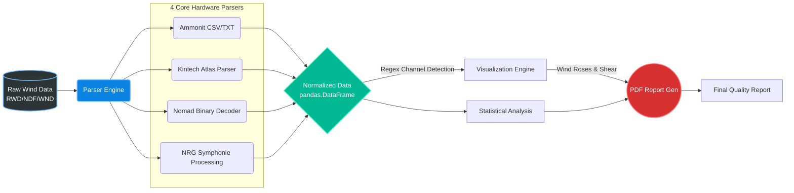

<div align="center">
  
  
  
  

  <br><br>
  <h1>NIWE Parsers</h1>
  <p><b>A meteorological data processing framework for parsing, reverse-engineering, visualizing, and reporting on industry-standard Wind Data Loggers.</b></p>
  <br>
</div>

---

## Overview

**NIWE Parsers** is a data engineering framework built to extract structured, engineering-ready datasets from raw meteorological loggers used in the wind energy sector. 

Whether you are dealing with proprietary binary logger formats (`.NDF`, `.WND`, `.RWD`) or structured text outputs, this pipeline provides an end-to-end mechanism to parse, standardize, and visualize the data into engineering-ready Excel files and PDF reports.

> **Note:** This project was developed for wind resource assessment, sensor quality validation, and air-density-adjusted power density calculations at NIWE (National Institute of Wind Energy).

| Parser | Standalone | Reverse-Engineered |
| :----- | :--------- | :----------------- |
| Nomad (`.NDF`) | Yes | Fully reverse-engineered |
| Kintech Atlas (`.WND`) | Yes | Fully reverse-engineered |
| Ammonit (CSV/TXT) | Yes | N/A — structured text input |
| NRG Symphonie (`.RWD`) | Uses official SDR | Custom post-processing & normalization |

## Features

* **Binary Reverse-Engineering:** Includes dedicated decoders for Second Wind Nomad (`.NDF`) and Kintech Atlas (`.WND`) binary files, developed as native standalone parsers through reverse engineering of the binary file formats.
* **Engineering-Compatible Resampling:** Implements standardized timestamp alignment, interval handling, and engineering-compatible resampling to produce engineering-ready outputs conforming to industry conventions.
* **Meteorological Computations:** Automatically computes Ideal Gas Air Density (ρ), Wind Power Density (WPD), Turbulence Intensity (TI30), and Wind Shear (α).
* **Automated Visualization:** Generates Wind Roses, vertical Wind Shear profiles, and Pearson correlation matrices to detect iced or failing anemometers.

---

## Architecture

The system is decoupled into four specialized hardware parsers. Below is an overview of the internal mechanics of each module:

### Ammonit (`ammonit/`)
Designed for **Ammonit** meteorological masts, focusing on extracting heavily nested CSV/TXT files.
* **Intelligent Sniffing:** Automatically identifies channels by scanning for regex patterns (e.g., matching `Speed` + `m/s` or `Direction` + `deg`).
* **Vertical Shear Extraction:** It parses sensor heights directly from the column headers (e.g., `WindSpeed_100m`) and dynamically aggregates the mean wind speeds to calculate the Wind Shear Exponent (α) using the highest available sensors.
* **Automated QA:** Outputs raw text-based statistical quality summaries before rendering the final visual PDF.

### Kintech (`kintech/`)
A dedicated parser for **Kintech Atlas** Output Data Files (`.wnd`) with a temporal resampling engine.
* **Temporal Transformation (`core/transform.py`):** Provides a strict grid resampling engine. It can take native 5-minute data and resample it to a strict 10-minute grid, filling missing timestamps with blanks to preserve temporal alignment.
* **Derived Statistics:** Computes Gust, Turbulence Intensity (TI30), and accurately propagates primary/secondary TI columns across redundant sensors.
* **Engineering Precision:** Implements strict round-half-up (ties away from zero) to match exact engineering specifications and correct floating-point boundaries.

### Nomad (`nomad/`)
Standalone reverse-engineered parser for **Second Wind Nomad** (`.NDF`) logger files.
* **Phase-1 Binary Scanning:** Utilizes `analysis/binary_scanner.py` to identify printable ASCII regions, compute stride histograms, and deduce fixed-size record layouts from the raw binary structure.
* **Byte-Level Parsing:** Reads the binary preamble, extracts calibration slopes and offsets from the channel definition table, and unpacks dense floating-point sensor records from the data block.
* **Automatic Layout Detection:** Automatically detects supported logger layouts and maps channels accordingly, accounting for firmware variations that alter slot positions across different deployment configurations.

### NRG Symphonie Processing (`nrg/`)
Automates the complete decoding workflow for **NRG Systems** Symphonie loggers (`.RWD` files). This module does not contain a standalone RWD decoder — it orchestrates the official SDR tool and post-processes its output.

**SDR Workflow:**
```
.RWD → SDR.exe (decode) → .TXT → Custom Normalization → .XLSX → Visualizations → PDF Reports
```

* **End-to-End SDR Automation:** Automatically invokes the official [Symphonie Data Retriever (SDR)](https://www.nrgsystems.com/support/product-support/software/symphonie-data-retriever-software) from NRG Systems to convert `.RWD` binaries into tab-delimited text.
* **Metadata Extraction:** Parses the SDR text header to extract channel numbers, sensor descriptions, serial numbers, and installation heights.
* **Header Normalization:** Dynamically maps generic SDR columns (like `CH1Avg`) to descriptive, serialized names (like `WindSpeed_100m_SN1933_Avg`), resolving duplicate channel names automatically.
* **Pipeline Integration:** Produces structured Excel outputs and feeds directly into the visualization and PDF reporting engine.

**Platform support:**
* **Windows:** SDR runs natively. The pipeline also supports [`nrgpy`](https://github.com/nrgpy/nrgpy) for direct SDR integration (`pip install nrgpy`).
* **macOS:** SDR runs through [Wine](https://wiki.winehq.org/Download) as a compatibility layer. Install Wine using the official instructions for your macOS version.

> **Important:** SDR is designed **only** for legacy NRG loggers (Symphonie, 9300, 9200-Plus, Wind Explorer) that produce `.RWD` files. If you have a **SymphoniePRO** logger (`.RLD` files), use the [SymphoniePRO Desktop Application](https://www.nrgsystems.com/support/product-support/software/) instead — SDR cannot read `.RLD` files.

---

## Mathematics and Visualization

Once data is extracted and normalized by the parsers, it enters `visualize_outputs.py`. The following meteorological computations are applied:

### Wind Shear (α) and Power Law
The engine extracts height metadata and computes the **Wind Shear Exponent (α)** using the Power Law profile. It utilizes the highest (H₂) and lowest (H₁) anemometers (V₂, V₁):

α = ln(V₂ / V₁) / ln(H₂ / H₁)

*Plotted as a vertical gradient profile to visualize boundary layer shear.*

### Air Density and Wind Power Density (WPD)
If a barometric pressure channel is available, the implementation computes Air Density (ρ) using a simplified form of the Ideal Gas Law under the assumption of a fixed standard temperature (T ≈ 288.15 K) and dry-air gas constant (R_spec ≈ 287.05 J/(kg×K)). The combined constant R_spec × T ≈ 82791:

ρ = P(Pa) / 82791.0

This ρ is then used to compute the **Wind Power Density** (0.5 × ρ × V³). Note: this approximation assumes a standard atmosphere temperature; for site-specific accuracy, measured temperature data should be incorporated.

### Wind Rose Generation
By coupling Wind Speed and Wind Direction channels, the engine maps valid intersections onto a polar coordinate system using `WindroseAxes`. This generates a directional frequency distribution, critical for micro-siting wind turbines.

### Anomaly Detection (Pearson Correlation)
A full cross-sensor Pearson correlation matrix is rendered as a Seaborn Heatmap. This highlights sensor drift or severe icing events (e.g., when the correlation between two redundant 100m anemometers drops significantly below `0.99`).

---

## Data Flow



---

## Quick Start

### 1. Clone the Repository

```bash
git clone https://github.com/neil-nickson/NIWE-parser.git
cd NIWE-parser
```

### 2. Install Requirements

```bash
pip install pandas matplotlib seaborn windrose openpyxl reportlab numpy
```

> **macOS:** The `nrg` module requires [Wine](https://wiki.winehq.org/Download) to execute the Windows-only `SDR.exe` backend. Install Wine using the official instructions for your macOS version.
>
> **Windows:** The `nrg` module also supports [`nrgpy`](https://github.com/nrgpy/nrgpy) for direct SDR integration: `pip install nrgpy`

### 3. Configure `config.json`

Each parser module contains its own `config.json`. Update paths as needed before running — particularly the `sdr_path` in `nrg/config.json` (see [Configuration](#configuration) below).

### 4. Place Input Files

Copy your raw logger files into the appropriate `input/` directory for the parser you want to run.

### 5. Run the Parser

Each module contains a `main.py` or `batch_decode.py` CLI entry point.

**Example: Kintech Pipeline**
```bash
cd kintech

# Run the full pipeline (Decode -> Visualize -> Report)
python3 main.py

# Skip decoding, visualize only from existing outputs
python3 main.py --visualize-only
```

**Example: Nomad Binary Reverse-Engineering**
```bash
cd nomad

# Phase-1: Run a structural scan to map out binary bytes
python3 main.py input/01-00001.NDF --analyze-only

# Auto-detect binary format and export to Excel workbook
python3 main.py input/01-00001.NDF
```

**Example: NRG Symphonie Processing**
```bash
cd nrg

# Place .RWD files in the input/ folder, then run:
python3 batch_decode.py
```

The RWD pipeline will detect all `.RWD` files in `input/`, convert each to `.TXT` via SDR, generate Excel files with descriptive headers, produce visualizations and PDF reports, and move processed `.RWD` files to `processed/`. Check `logs/` for timestamped run logs.

### 6. Collect Reports

After a successful run, find your outputs in each module's output, `visualizations/`, and `reports/` directories. Note: the output folder name varies by module (e.g., `outputs/` in nrg and nomad, `output/` in kintech).

---

## Supported Logger Formats

| Logger            | Input Format | Output      | Status                           |
| :---------------- | :----------- | :---------- | :------------------------------- |
| Ammonit           | CSV / TXT    | Excel + PDF | Supported                        |
| Second Wind Nomad | `.NDF`       | Excel + PDF | Standalone Reverse-Engineered    |
| Kintech Atlas     | `.WND`       | Excel + PDF | Standalone Reverse-Engineered    |
| NRG Symphonie     | `.RWD`       | Excel + PDF | SDR-Based Automated Processing   |

---

## Configuration

Each parser module contains its own `config.json` for customizing input/output paths and tool locations.

### NRG Module Configuration

**Directory layout:**
```
nrg/
├── batch_decode.py          # Main pipeline script
├── visualize_outputs.py     # Visualization generation
├── generate_pdf_reports.py  # PDF report generation
├── config.json              # ← Edit this before running
├── input/                   # Place .RWD files here
├── outputs/
│   └── txt/                 # Decoded text files from SDR
├── visualizations/          # Generated charts
├── reports/                 # Text + PDF reports
├── processed/               # Successfully processed .RWD files
└── logs/                    # Timestamped run logs
```

**Example `config.json`:**
```json
{
  "sdr_path": "C:\\NRG\\SymDR\\SDR.exe",
  "input_folder": "input",
  "txt_output": "outputs/txt",
  "excel_output": "outputs",
  "processed_folder": "processed",
  "visualizations_folder": "visualizations",
  "reports_folder": "reports",
  "logs_folder": "logs"
}
```

### Configuration Key Reference

| Key                       | Description                                                                 | Default            |
| :------------------------ | :-------------------------------------------------------------------------- | :----------------- |
| `sdr_path`                | **Absolute path** to `SDR.exe`. On macOS, use the Wine-mapped path.         | *(required)*       |
| `input_folder`            | Directory where `.RWD` files are placed for processing                      | `input`            |
| `txt_output`              | Directory where SDR writes decoded `.TXT` files                             | `outputs/txt`      |
| `excel_output`            | Directory where generated `.XLSX` Excel files are saved                     | `outputs`          |
| `processed_folder`        | Directory where `.RWD` files are moved after successful processing          | `processed`        |
| `visualizations_folder`   | Directory where chart images (`.png`) are saved                             | `visualizations`   |
| `reports_folder`          | Directory where text and PDF reports are saved                              | `reports`          |
| `logs_folder`             | Directory where timestamped log files are saved                             | `logs`             |
| `use_site_file`           | Set to `true` to use a `.NSF` site file during SDR conversion               | `false`            |
| `site_file_path`          | Absolute path to the `.NSF` site file (only when `use_site_file` is `true`) | `""`               |

> All folder paths are **relative to the `nrg/` directory** unless specified as absolute paths. The pipeline creates directories automatically if they don't exist.

> **Important:** The `sdr_path` must point to the installed location of the NRG Symphonie Data Retriever (`SDR.exe`).
> - **Windows:** Use the native install path, e.g., `"C:\\NRG\\SymDR\\SDR.exe"`
> - **macOS:** Use the Wine-mapped path, e.g., `"/Users/<username>/.wine/drive_c/NRG/SymDR/SDR.exe"`
>
> Download SDR from the [official NRG Systems page](https://www.nrgsystems.com/support/product-support/software/symphonie-data-retriever-software) (free account required).

**Site File (.NSF) support:** Some NRG loggers require a `.NSF` site file during conversion to correctly apply sensor calibrations. If SDR produces no `.TXT` output, set `"use_site_file": true` and `"site_file_path"` to the absolute path of your `.NSF` file. Obtain the `.NSF` from the logger's project owner or field team.

---

## Troubleshooting

| Problem | Cause | Fix |
| :------ | :---- | :-- |
| `SDR.exe not found at: ...` | Incorrect `sdr_path` in `config.json` | Verify SDR is installed and update the path. On macOS, check `~/.wine/drive_c/`. |
| `'wine' command not found` | Wine is not installed (macOS) | Install Wine from [wiki.winehq.org/Download](https://wiki.winehq.org/Download). |
| No TXT files produced | SDR needs a `.NSF` site file for this logger | Set `use_site_file` to `true` and provide the `.NSF` path in `config.json`. |
| `Header count mismatch: X headers for Y data columns` | Sensor metadata block doesn't match data columns | Check the raw `.TXT` in `outputs/txt/` — this can happen with corrupted `.RWD` files. |
| `SDR timed out processing <file>.RWD` | 60-second timeout expired | Try running manually: `wine ~/.wine/drive_c/NRG/SymDR/SDR.exe /q "C:\NRG\RawData\<file>.RWD"` |

---

## Repository Structure

```
NIWE-Parsers/
├── ammonit/              # Ammonit mast data parser (CSV/TXT)
├── kintech/              # Kintech Atlas binary decoder (.WND)
├── nomad/                # Second Wind Nomad binary decoder (.NDF)
├── nrg/                  # NRG Symphonie SDR-based pipeline (.RWD)
└── README.md
```

---

## License

This project is licensed under the MIT License. See the [LICENSE](LICENSE) file for details.

---

## Acknowledgements

This project was developed during an internship at the **National Institute of Wind Energy (NIWE)**, Chennai, as part of work on automated wind resource data processing and analysis.

---

<div align="center">
  <p><i>Built for precision meteorological data processing and wind resource assessment.</i></p>
</div>
