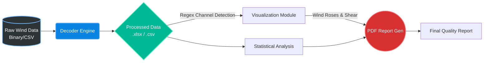

<div align="center">
  
  
  
  
  <h1>🌪️ NIWE Parsers</h1>
  <p><b>Advanced Data Parsing, Visualization, and Reporting for Wind Meteorological Loggers</b></p>
</div>

---

## 📖 Overview

**NIWE Parsers** is a state-of-the-art automated software pipeline designed to decode, analyze, and visualize raw meteorological data from industry-standard **Wind Data Loggers**. The system handles full end-to-end processing: from reverse-engineering binary payloads and parsing raw formats, to generating interactive wind visualizations (wind roses, wind shear profiles, cross-correlations) and publishing comprehensive quality reports in PDF format.

### ✨ Key Features
- **Universal Wind Data Decoding**: Automatically sniff and decode complex, proprietary binary formats and raw text files from anemometers, vanes, and environmental sensors.
- **Intelligent Wind Visualizations**: Generate high-quality statistical plots including Wind Roses, Correlation Heatmaps, and Wind Shear profiles.
- **Automated PDF Reporting**: Compile data quality summaries, sensor statistics, and visualizations into professional, client-ready PDF reports.
- **Batch Processing**: Scalable CLI tools to decode and process entire directories of logger outputs in one seamless operation.

## 🏗️ Architecture & Supported Loggers

The project is modularized into dedicated parsers and processors tailored to specific hardware manufacturers.

| Logger Family | Description | Key Modules |
| :--- | :--- | :--- |
| **Ammonit** | Parsing pipelines for Ammonit meteorological masts. | `ammonit/batch_decode.py`, `visualize_outputs.py` |
| **Kintech** | Dedicated parsers for Kintech engineering systems. | `kintech/kintech_parser.py`, `kintech/main.py` |
| **Nomad** | Complex binary structure decoding for Nomad 2 / Nomad 3 loggers. | `nomad/decoders/nomad_ndf.py`, `nomad/main.py` |
| **RWD Automation** | Automation pipeline for continuous Raw Wind Data (RWD) processing. | `RWD_Automation/batch_decode.py`, `visualize_outputs.py` |

### ⚙️ How It Works: The Wind Data Engine

The core of the system relies on intelligent column detection and specialized wind data mathematics. Here is a breakdown of how the engine processes wind parameters:

1. **Intelligent Channel Detection**: 
   The system parses the raw data headers using smart Regular Expressions (Regex) to dynamically identify wind channels regardless of the logger's naming convention.
   ```python
   REGEX_WS = re.compile(r"Spd|Wind Speed|WS|Anemometer|WindSpeed", re.IGNORECASE)
   REGEX_WD = re.compile(r"Dir|Direction|WD|WindDirection|Vane", re.IGNORECASE)
   ```

2. **Wind Shear Calculation ($\\alpha$)**:
   The engine automatically extracts height metadata from column names (e.g., `WindSpeed_100m_SN1933_Avg` -> `100m`) and computes the **Wind Shear Exponent ($\\alpha$)** using the Power Law profile. It utilizes the highest ($H_2$) and lowest ($H_1$) anemometer readings ($V_2, V_1$):
   $$ \\alpha = \\frac{\\ln(V_2 / V_1)}{\\ln(H_2 / H_1)} $$
   This mathematically determines the vertical wind speed gradient.

3. **Wind Rose Generation**:
   By coupling the detected Wind Speed (`ws_col`) and Wind Direction (`wd_col`) channels, the engine groups the data into directional sectors and speed bins. The valid intersections are mapped onto a polar coordinate system using `WindroseAxes` to generate a directional frequency distribution.

4. **Anomaly Detection via Correlation**:
   The `plot_correlation_heatmap` function computes the Pearson correlation matrix across all numeric wind data columns. This highlights inconsistencies, such as iced anemometers (where correlation drops between redundant sensors at the same height).

### Pipeline Workflow



## 🚀 Quick Start

### 1. Installation

Ensure you have Python 3.9+ installed. The environment requires standard data processing and plotting libraries (`pandas`, `matplotlib`, `seaborn`, `windrose`, `fpdf2`, `openpyxl`).

### 2. Processing Data

Each parser module comes with a unified `main.py` CLI entry point for orchestration.

**Example: Processing Kintech Wind Data**
```bash
cd kintech

# Run the full pipeline (Decode -> Visualize -> Report)
python3 main.py

# Process a single specific output file
python3 main.py --file output/ID150008_20210324.csv

# Only generate visualizations (skip decoding)
python3 main.py --visualize-only
```

**Example: Decoding Nomad Binary Wind Data**
```bash
cd nomad

# Auto-detect binary format and export to Excel workbook
python3 main.py input/01-00001.NDF

# Run a binary structure scan (Phase-1 analysis without decoding)
python3 main.py input/01-00001.NDF --analyze-only
```

## 📊 Visualizations & Outputs

The `visualize_outputs.py` engine generates tailored, publication-ready plots for wind resource assessment:
- **Wind Roses**: Directional frequency distribution and energy density.
- **Wind Shear Profiles**: Vertical wind speed gradients across different heights calculated with the $\\alpha$ exponent.
- **Correlation Heatmaps**: Sensor cross-correlation for identifying anomalies or icing events between redundant anemometers.
- **Environmental Time-Series**: Temperature, Pressure, Humidity, and Battery Voltage trends to assess logger health and air density parameters.

All visualizations are exported as high-resolution `.png` files into the respective `visualizations/` directories and embedded into the final PDF deliverables.

## 📂 Project Structure

```text
NIWE Parsers/
├── ammonit/                  # Ammonit mast parsers & reporting
│   ├── batch_decode.py
│   └── visualize_outputs.py
├── kintech/                  # Kintech logger decoding pipeline
│   ├── core/                 # Core reading/writing & models
│   ├── kintech_parser.py     # Parser logic
│   └── main.py               # Kintech CLI orchestration
├── nomad/                    # Nomad universal binary decoders
│   ├── decoders/             # Specific hardware decoders (e.g., Nomad NDF)
│   ├── analysis/             # Binary scanners & structure detectors
│   └── main.py               # Nomad CLI orchestration
└── RWD_Automation/           # Raw Wind Data automation scripts
    ├── batch_decode.py
    └── visualize_outputs.py  # Core wind math and plotting engine
```

## 🛠️ Development & Extensibility

Adding support for a new logger format is straightforward. For example, in the **Nomad** pipeline, simply create a new decoder class inheriting from `BaseDecoder`:

```python
from decoders.base_decoder import BaseDecoder
from decoders import register_decoder

@register_decoder
class NewLoggerDecoder(BaseDecoder):
    format_name = "new_logger_format"
    
    def sniff(self, data: bytes) -> bool:
        # Detect magic headers or binary signatures
        return data.startswith(b"MAGIC_HEADER")
        
    def parse_records(self, data, metadata, **kwargs):
        # Extractor implementation here
        pass
```

---
<div align="center">
  <p><i>Developed for advanced wind data analysis and meteorological reporting.</i></p>
</div>
